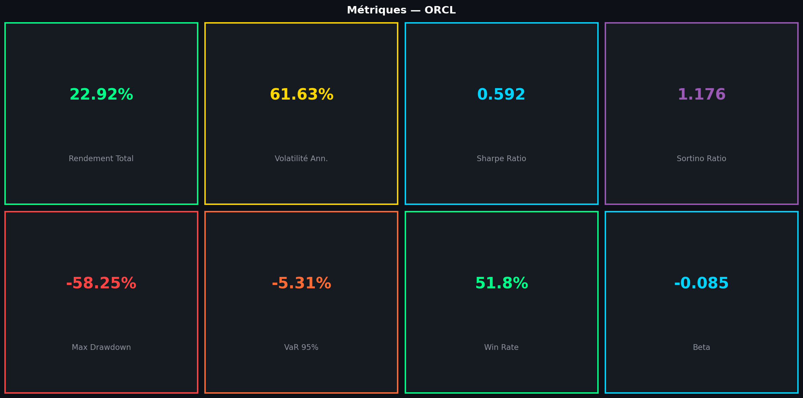

# Quant Report Generator

**Application desktop qui transforme des données de marché brutes (Yahoo Finance ou Excel) en rapport PowerPoint quantitatif complet : pricing d'options, portefeuille, backtesting, risque et signaux.**



---

## 🇫🇷 Version française

### Aperçu

Quant Report Generator est une application graphique (Tkinter) qui automatise un travail que ferait normalement un analyste quant à la main : télécharger des données, les nettoyer, calculer une batterie d'analyses quantitatives, générer les graphiques, et assembler le tout dans un rapport PowerPoint prêt à partager.

Workflow :
1. Sélectionner une source (Yahoo Finance ou fichier Excel local)
2. Analyser automatiquement la structure des données via un modèle IA (Groq/Llama)
3. Calculer l'ensemble des analyses quantitatives (voir *Modules* ci-dessous)
4. Générer tous les graphiques
5. Assembler un rapport PowerPoint

### Démonstration

Le dossier `rapports_generés/` contient un rapport complet généré pour ORCL : **23 graphiques + un fichier PowerPoint**, couvrant tous les modules du projet (pricing d'options, Monte Carlo, Heston, backtesting, facteurs, stress tests) — la preuve concrète que le pipeline fonctionne de bout en bout, pas seulement une collection de fonctions isolées.

### Modules quantitatifs

**Pricing d'options**
- Black-Scholes complet : prix call/put, les 8 Greeks (delta, gamma, vega, theta, rho, vanna, volga), volatilité implicite par inversion numérique (méthode de Brent), surface de volatilité
- Vérification analytique intégrée : test de parité put-call (`put_call_parity_check`)
- Modèle de Heston (volatilité stochastique) : simulation, pricing, calibration sur prix de marché, comparaison directe avec Black-Scholes
- Monte Carlo pour options exotiques : vanille européenne, barrière knock-in/knock-out, asiatique (arithmétique/géométrique), lookback (fixe/flottant), digitale — avec variance de réduction par échantillonnage antithétique

**Construction de portefeuille**
- Variance minimale, Sharpe maximum (portefeuille tangent), équipondéré, risk parity
- Frontière efficiente
- Modèle de Black-Litterman (intégration de vues d'investisseur)

**Facteurs & risque**
- Modèles Fama-French à 3 et 5 facteurs, CAPM
- Stress tests sur scénarios de crise historiques
- Métriques glissantes : Sharpe, volatilité, drawdown, beta, Sortino

**Signaux & backtesting**
- Signaux techniques : RSI, MACD, Bollinger, moyennes mobiles, momentum, mean-reversion
- Stratégies backtestées : momentum, mean-reversion, croisement de moyennes mobiles
- Métriques de backtest complètes (Sharpe, drawdown, win rate, etc.)

**Automatisation IA**
- Analyse automatique de la structure d'un fichier Excel via l'API Groq (modèle Llama 3.3 70B) : détection des colonnes de prix/dates sans configuration manuelle
- Génération automatique du rapport PowerPoint (texte + graphiques)

### Structure du projet

```
quant_report_generator/
├── main.py                 # Interface graphique (Tkinter) — point d'entrée
├── config.py                # Configuration (clé API Groq via .env)
├── data_fetcher.py           # Téléchargement Yahoo Finance + export Excel
├── excel_analyzer.py          # Analyse de structure Excel assistée par IA
├── quant_calculator.py         # Orchestration de toutes les analyses quantitatives
├── chart_generator.py           # Génération des graphiques de base
├── report_generator.py           # Assemblage du rapport PowerPoint
├── modules/
│   ├── black_scholes.py          # Pricing + Greeks + volatilité implicite
│   ├── heston.py                  # Volatilité stochastique, calibration
│   ├── monte_carlo.py              # Simulation de prix, VaR Monte Carlo
│   ├── monte_carlo_options.py       # Options exotiques (barrière, asiatique, lookback, digitale)
│   ├── portfolio.py                  # Optimisation de portefeuille, Black-Litterman
│   ├── factor_model.py                # Fama-French 3/5 facteurs, CAPM
│   ├── backtesting.py                  # Stratégies + métriques de backtest
│   ├── signals.py                       # Signaux techniques
│   ├── rolling_metrics.py                # Métriques glissantes
│   ├── stress_testing.py                  # Scénarios de crise
│   └── chart_advanced.py                   # Graphiques avancés (dashboards, surfaces de vol)
├── data/                    # Exemples de données (Excel générés)
├── rapports_generés/         # Rapport de démonstration complet (ORCL)
├── tests/
│   └── test_pricing_and_portfolio.py
├── requirements.txt
├── .env.example
└── LICENSE
```

### Installation

```bash
git clone <url-du-dépôt>
cd quant_report_generator
python -m venv venv
source venv/bin/activate        # Windows : venv\Scripts\activate
pip install -r requirements.txt
cp .env.example .env            # puis renseigner ta clé API Groq (gratuite sur console.groq.com)
```

### Utilisation

```bash
python main.py
```

Interface graphique : choisir une source de données (téléchargement Yahoo Finance ou import Excel), lancer l'analyse, le rapport PowerPoint est généré dans `rapports_generés/`.

### Tests

```bash
pytest tests/
```

Les tests vérifient la cohérence analytique du pricer Black-Scholes (parité put-call, volatilité implicite qui retrouve exactement la volatilité d'entrée, delta proche de 1 pour une option très dans la monnaie) et les propriétés du portefeuille optimal (poids qui somment à 1, Sharpe du portefeuille tangent ≥ Sharpe du portefeuille à variance minimale).

### Stack technique

Python · Tkinter (GUI) · pandas · NumPy · SciPy · Matplotlib/Seaborn · yfinance · python-pptx · Groq API (Llama 3.3 70B) · pytest

### Limites & pistes d'amélioration

- L'analyse de structure Excel dépend de la disponibilité de l'API Groq (service externe) — un mode 100% local (sans IA) serait un repli utile.
- Interface Tkinter pensée pour un usage bureau ponctuel, pas pour une intégration production.
- La qualité des rapports dépend directement de la qualité des données d'entrée.

---

## 🇬🇧 English version

### Overview

Quant Report Generator is a desktop GUI application (Tkinter) that automates work a quant analyst would normally do by hand: download data, clean it, run a full battery of quantitative analyses, generate the charts, and assemble everything into a ready-to-share PowerPoint report.

Workflow:
1. Select a source (Yahoo Finance or a local Excel file)
2. Automatically analyze the data structure via an AI model (Groq/Llama)
3. Run the full set of quantitative analyses (see *Modules* below)
4. Generate all charts
5. Assemble a PowerPoint report

### Demo

The `rapports_generés/` folder contains a complete report generated for ORCL: **23 charts + a PowerPoint file**, covering every module in the project (option pricing, Monte Carlo, Heston, backtesting, factor models, stress tests) — concrete proof the pipeline works end-to-end, not just a collection of isolated functions.

### Quantitative modules

**Option pricing**
- Full Black-Scholes: call/put price, all 8 Greeks (delta, gamma, vega, theta, rho, vanna, volga), implied volatility via numerical inversion (Brent's method), volatility surface
- Built-in analytical check: put-call parity test (`put_call_parity_check`)
- Heston model (stochastic volatility): simulation, pricing, calibration to market prices, direct comparison with Black-Scholes
- Monte Carlo for exotic options: European vanilla, knock-in/knock-out barrier, Asian (arithmetic/geometric), lookback (fixed/floating), digital — with antithetic-sampling variance reduction

**Portfolio construction**
- Minimum variance, maximum Sharpe (tangency portfolio), equal-weight, risk parity
- Efficient frontier
- Black-Litterman model (incorporating investor views)

**Factors & risk**
- Fama-French 3- and 5-factor models, CAPM
- Stress tests on historical crisis scenarios
- Rolling metrics: Sharpe, volatility, drawdown, beta, Sortino

**Signals & backtesting**
- Technical signals: RSI, MACD, Bollinger, moving averages, momentum, mean-reversion
- Backtested strategies: momentum, mean-reversion, moving-average crossover
- Full backtest metrics (Sharpe, drawdown, win rate, etc.)

**AI-assisted automation**
- Automatic Excel structure analysis via the Groq API (Llama 3.3 70B): detects price/date columns with no manual configuration
- Automatic PowerPoint report generation (text + charts)

### Project structure

```
quant_report_generator/
├── main.py                 # GUI (Tkinter) — entry point
├── config.py                # Configuration (Groq API key via .env)
├── data_fetcher.py           # Yahoo Finance download + Excel export
├── excel_analyzer.py          # AI-assisted Excel structure analysis
├── quant_calculator.py         # Orchestrates every quantitative analysis
├── chart_generator.py           # Base chart generation
├── report_generator.py           # PowerPoint report assembly
├── modules/
│   ├── black_scholes.py          # Pricing + Greeks + implied volatility
│   ├── heston.py                  # Stochastic volatility, calibration
│   ├── monte_carlo.py              # Price simulation, Monte Carlo VaR
│   ├── monte_carlo_options.py       # Exotic options (barrier, Asian, lookback, digital)
│   ├── portfolio.py                  # Portfolio optimization, Black-Litterman
│   ├── factor_model.py                # Fama-French 3/5-factor, CAPM
│   ├── backtesting.py                  # Strategies + backtest metrics
│   ├── signals.py                       # Technical signals
│   ├── rolling_metrics.py                # Rolling metrics
│   ├── stress_testing.py                  # Crisis scenarios
│   └── chart_advanced.py                   # Advanced charts (dashboards, vol surfaces)
├── data/                    # Sample data (generated Excel files)
├── rapports_generés/         # Full demo report (ORCL)
├── tests/
│   └── test_pricing_and_portfolio.py
├── requirements.txt
├── .env.example
└── LICENSE
```

### Installation

```bash
git clone <repo-url>
cd quant_report_generator
python -m venv venv
source venv/bin/activate        # Windows: venv\Scripts\activate
pip install -r requirements.txt
cp .env.example .env            # then fill in your Groq API key (free tier at console.groq.com)
```

### Usage

```bash
python main.py
```

GUI: pick a data source (Yahoo Finance download or Excel import), run the analysis, the PowerPoint report is generated under `rapports_generés/`.

### Tests

```bash
pytest tests/
```

Tests check the analytical consistency of the Black-Scholes pricer (put-call parity, implied volatility exactly recovering the input volatility, delta close to 1 for a deep in-the-money option) and optimal-portfolio properties (weights summing to 1, tangency portfolio's Sharpe ≥ minimum-variance portfolio's).

### Tech stack

Python · Tkinter (GUI) · pandas · NumPy · SciPy · Matplotlib/Seaborn · yfinance · python-pptx · Groq API (Llama 3.3 70B) · pytest

### Limitations & next steps

- Excel structure analysis depends on the Groq API being available (external service) — a fully local, AI-free fallback mode would be a useful addition.
- Tkinter interface designed for one-off desktop use, not production integration.
- Report quality directly depends on input data quality.

---

## Author

**Deo ZANTOKO** — Engineering student in Applied Mathematics, Mathematical Modelling for Finance & Insurance (MMFA), CY Tech

## License

MIT — see [LICENSE](LICENSE).
